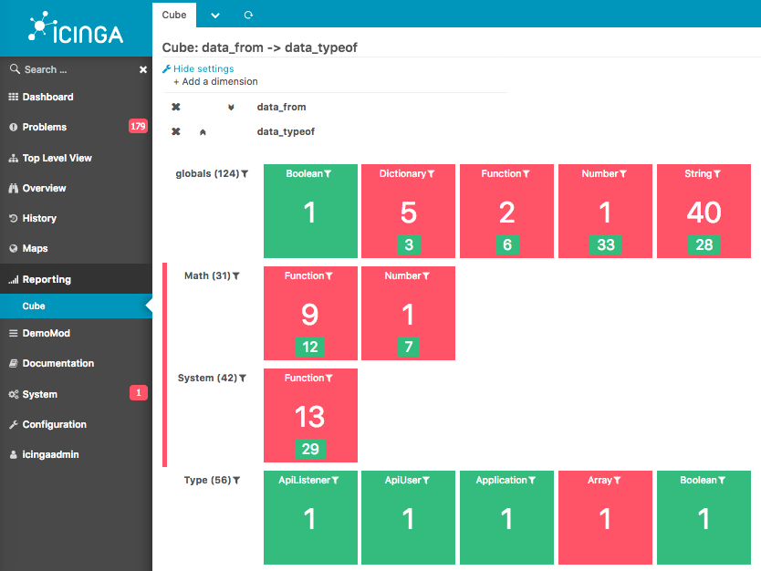

# DemoMod

DemoMod is a demonstration module. It constructs a demo environment that is based on the Icinga2 configuration language.
It uses some additional icingaweb modules like

* [icingaweb2-module-nagvis](https://github.com/icinga/icingaweb2-module-nagvis) for [NagVis](http://nagvis.org/) integration.
* [icingaweb2-module-map](https://github.com/nbuchwitz/icingaweb2-module-map)
* [icingaweb2-module-cube](https://github.com/icinga/icingaweb2-module-cube)

When using the demo, it creates in icinga2 round about 230 addition Host objects and 1000 Service objects. It creates host dependency by parent host. The host objects have some addition Information, like dependency, geolocation for map.

## What it is?
A simple demo! Maybe good for education.

## What it is not!
Not a real monitoring. It is just demo mod!

## Screenshots
Some screenshots with the enabled demomod.

### Tactical overview

### Hostgroup

### Module map if available
If you have the module map enabled:

### Module cube if available

### Module nagvis if avaible
With the dependency in the nodes you get nice views.

### Module businessprocess if availabble
TODO

### Module toplevelview if available
TODO
